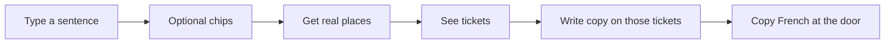
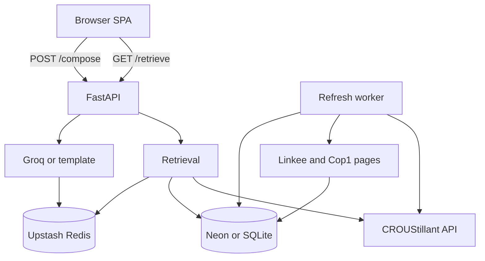

# Assiette — product guide for a solo founder

**What this file is:** one place to understand the whole product. Idea, plan, how it was built, how the system works, which files do what, and what you do day to day.

It is written in short, simple English. “You” means the founder running this. “The student” means the person using the site.

If you only want the story (why this exists), read [00-star-story.md](00-star-story.md) instead. Course homework files stay in `docs/phase*.md`. This file is the operating manual.

**Words used once, then reused:**

- **CROUS** — French student canteens. Cheap meals (about €3.30, or €1 with a bursary).
- **Distribution** — a free or almost-free food handout from a charity (Linkee, Cop1, and others).
- **Retrieve** — code looks up real places that match the student’s need.
- **Compose** — the language model writes the sentences on the tickets, using only those places.
- **Grounding** — a hard rule in code: if a place was not retrieved, it cannot appear.
- **Staging** — scraped data waits here until you approve it. It is not live search results yet.

---

## 1. What this is (30 seconds)

Assiette turns one sentence like *“I’m in the 13th, €3, dinner after 18:00”* into a short list of **real** cheap Paris meals: live CROUS menus plus charity distributions, plus French to say at the door.

It is a **non-commercial** student project. It never invents a restaurant. It never claims how many parcels are left. It never asks for donations.

The AI writes the wording. The code decides which places exist.

---

## 2. The idea

Tuesday, 18:20. Classes just ended. The student has €3, is in the 13th, and is hungry.

Today they bounce between three bad options:

1. The CROUS app lists canteens, but not “open now, in my budget, near me.”
2. Charities each have their own site, hours, and rules. None of it is in one place.
3. They guess, walk to a lunch-only canteen, and buy a kebab they cannot afford.

The gap is not missing data. CROUS publishes menus. Charities publish hours. The gap is **one honest answer** from a normal sentence.

Assiette is that answer: a few tickets, not a chatbot thread. Each ticket is a place you can actually go.

---

## 3. The plan we followed

Four rules from day one. They still hold.

1. **Retrieve first, then write copy.** Ranking is arithmetic (distance, price, open now). The language model only writes after that. There is no agent that calls tools in a loop.
2. **Never invent a venue.** If Groq names a place that was not retrieved, code drops it. Tests check this.
3. **Do not scrape charities on the student’s request.** A background job fetches pages. Results wait in staging until you approve them.
4. **Polling, not live streams.** The page re-checks place lists on a timer. It never re-runs the written itinerary automatically.

What we deliberately did **not** build: booking a charity slot, voice, cities outside Paris, donation links, websockets.

An older Streamlit demo is gone. The live app is FastAPI plus a small TypeScript page.

---

## 4. What a student does



1. Home (`/`). The student types a sentence. Optional chips: arrondissement 1–20, budget, meal, diet, bursary.
2. The page calls **retrieve**. Tickets can already appear from real places.
3. Then it calls **compose**. Friendly summary, caveats, French phrases land on those same tickets.
4. About every five minutes (and when the tab is focused again), retrieve runs again so hours/menus can refresh. **Compose is not re-run.** Old wording stays until they submit again.

Other pages:

- **Sign in** (`/signin`) — magic link for student emails. The search itself does not require login.
- **About** (`/about`) — how we stay honest, last refresh runs, scrape health, how many candidates wait for you.

---

## 5. How it is built (implementation)

Two parts, one product.

| Piece | What it is |
|---|---|
| Screen | Vite + vanilla TypeScript. No React. Three routes: home, sign-in, about. Tickets are the product. |
| Server | FastAPI. Retrieve, compose, health, auth screens, venue reads. |
| Database | SQLite on your laptop (`assiette.db`). Neon Postgres in production. |
| Language model | Groq, optional. Empty key → the app still works with template text. |
| Background job | Warms CROUS cache, re-reads the charity JSON, scrapes Linkee/Cop1 into staging. |

Local: FastAPI can serve the built frontend from `frontend/dist`.

Production: Vercel Hobby. Static files + one Python function (`api/index.py`, 30 second limit). That is why we poll instead of streaming.

---

## 6. Architecture



**On the student’s path (must stay fast):**

- Retrieve ranks real CROUS restaurants (Paris region `22`) and active distributions from the database.
- Compose asks Groq for JSON copy, then **drops any stop id that was not retrieved**.

**Off the student’s path (slow work lives here):**

- GitHub Actions every 6 hours, or `python -m backend.refresh.worker`, or `POST /internal/refresh`.
- Scrapes never write straight into live search. They land in `scraped_candidates`. You approve or reject.

**Stores, in one line each:**

- Database — venues, hours, versions, refresh runs, users, scrape candidates.
- Upstash Redis REST — shared cache (CROUS lists, menus, circuit breaker) across cold serverless starts.
- `REDIS_URL` (TCP Redis) — shared rate limits. Different protocol from the REST cache. Both matter in production.
- `data/distributions.json` — your curated charity list until a scrape is approved.
- `data/fallback_restaurants.json` — last-resort CROUS list if the live API is down.

---

## 7. Technology stack and why

| Tool | Why it is here |
|---|---|
| **FastAPI + Uvicorn** | One Python API. Fits Vercel’s Python function. |
| **Vite + vanilla TypeScript** | Tiny UI, no React tax on Hobby. |
| **Groq** (`openai/gpt-oss-20b`) | Cheap, fast JSON. Two jobs: parse a sentence (on `/query` only) and write ticket copy. |
| **CROUStillant** | Official live Paris CROUS menus. Non-commercial use only. |
| **SQLAlchemy + Alembic** | Schema changes you can replay (`alembic upgrade head`). |
| **Neon Postgres** | Serverless database. Use the **pooler** URL so functions do not exhaust connections. |
| **Upstash Redis** | Shared cache when every request may be a cold start. |
| **SlowAPI** | Caps requests so Groq and CROUS are not hammered. |
| **BeautifulSoup** | Parse charity HTML in the worker, not on `/retrieve`. |
| **GitHub Actions** | Tests, migrate-then-deploy, 6-hour refresh. |
| **Vercel Hobby** | Hosting. Non-commercial only. No donation links. |
| **Resend or SMTP** | Magic-link email. Optional locally. |

**Deliberate non-choices:** no vector database, no chatbot loop, no streaming. Ranking is deterministic. Generation is one JSON object. That is the simplest shape that still feels like AI.

---

## 8. How the code actually works

You do not need to memorise this. When something breaks, start here.

### 8.1 Home: retrieve, then compose

[`frontend/src/pages/home.ts`](../frontend/src/pages/home.ts) submits the sentence and chips. It does **not** rebuild the whole page. It patches `#results`.

[`frontend/src/api.ts`](../frontend/src/api.ts) calls:

1. `GET /retrieve` — [`backend/routers/query.py`](../backend/routers/query.py)
2. `POST /compose` with the place ids that came back

[`frontend/src/components/ticketCard.ts`](../frontend/src/components/ticketCard.ts) joins compose text to retrieved places **by id**. If compose returns nothing usable, it falls back to the top retrieved places. The student still sees real venues.

[`frontend/src/freshness.ts`](../frontend/src/freshness.ts) re-fetches `/retrieve` on an interval and on tab focus. It never calls compose again.

`POST /query` still exists as a one-shot retrieve+compose for tests. The live UI does not use it.

### 8.2 Ranking (retrieve)

[`assiette/retrieval.py`](../assiette/retrieval.py) `rank_places()`:

- CROUS list via [`assiette/crous_client.py`](../assiette/crous_client.py) (live, cache, or fallback JSON).
- Distributions from the database, else [`data/distributions.json`](../data/distributions.json).
- Score: proximity + open-for-slot + budget (diet after menus).
- Today’s menu only for a short CROUS shortlist.
- Extra notes from [`data/knowledge.md`](../data/knowledge.md) by keyword overlap, not vectors.

On the SPA, intent is **heuristic** (chips + regex). Groq intent parse runs on `/query`, not on `/retrieve`.

### 8.3 Grounding (compose)

[`assiette/llm.py`](../assiette/llm.py) `generate_itinerary()`:

- Groq returns `{summary, stops, caveats}`.
- Any `stop.id` not in the retrieved id set is **dropped**.
- If Groq is down, the key is missing, or prose names a venue that was not retrieved, a **template** itinerary is used instead.

That is why “never invent a venue” is a product promise, not a prompt wish. Tests: `tests/test_retrieval.py`, `tests/test_api.py`.

### 8.4 Scrapes stay in staging

[`assiette/scrapers/`](../assiette/scrapers/) fetch Linkee and Cop1. They respect `robots.txt`, send a clear User-Agent, and use the same circuit breaker as Groq/CROUS.

[`backend/refresh/pipeline.py`](../backend/refresh/pipeline.py) writes rows to `scraped_candidates`. Status: `new`, `changed`, or `unchanged`. **Search does not see them yet.**

If a scrape looks broken (zero rows, or far fewer than last time), the run is **suspect**. The pipeline then **does not** auto-deactivate old venues.

You publish a row with [`backend/routers/admin.py`](../backend/routers/admin.py): approve calls the same `upsert_venue` path as seed, tagged `verifier="human:review"`.

### 8.5 Files that matter

| File | Role |
|---|---|
| `frontend/src/main.ts` | Shell: `/`, `/signin`, `/about`. Rebuild only on route, language, or auth. |
| `frontend/src/pages/home.ts` | Query → retrieve → compose → tickets. |
| `backend/api.py` | FastAPI app. Mounts `/internal/*` only if `REFRESH_TOKEN` is 32+ characters. |
| `api/index.py` | Vercel entry (`from backend.api import app`). |
| `backend/services/retrieval_service.py` | Intent + ranked venues + cache. |
| `backend/services/query_service.py` | One-shot retrieve then generate. |
| `assiette/retrieval.py` | Ranking. |
| `assiette/llm.py` | Groq JSON + drop unknown ids. |
| `backend/repo.py` | Venues, freshness, candidates. God-node of the data layer. |
| `backend/refresh/worker.py` | CLI: `--source all` or `--review`. |
| `data/distributions.json` | Curated charity venues. |
| `vercel.json` | Static frontend + API rewrites + 30s Python function. |
| `.env.example` | Every operator knob. Copy to `.env`. Never commit `.env`. |

---

## 9. Rules we never break

- **Never invent a venue.** Grounding is code.
- **Paris only.** CROUS region 22, arrondissements 1–20.
- **No live parcel counts.** We do not know how many baskets are left.
- **No donation links.** Vercel Hobby and CROUStillant are non-commercial.
- **No agent/tool loop.** Retrieve, then generate.
- **No websockets / SSE.** Poll `/retrieve` only.
- **Production `SECRET_KEY`** must be 32+ characters or the app refuses to boot.
- **`REFRESH_TOKEN`** must be 32+ characters or `/internal/*` does not exist (you cannot approve scrapes over HTTP).

---

## 10. What you do as the founder

### 10.1 First time on this laptop (PowerShell)

```powershell
python -m venv .venv
.venv\Scripts\activate
pip install -r requirements.txt
npm --prefix frontend install
copy .env.example .env
```

Edit `.env` in the **project root** (same folder as `README.md`):

- `SECRET_KEY` — random string, 32+ characters
- `REFRESH_TOKEN` — a **different** random string, 32+ characters
- `GROQ_API_KEY` — optional

Then:

```powershell
alembic upgrade head
python -m backend.db.seed
npm --prefix frontend run build
python -m uvicorn backend.api:app --reload
```

Open http://127.0.0.1:8000

Hot-reload UI (API already on :8000): `npm --prefix frontend run dev` → http://127.0.0.1:5173

Windows: use `python -m uvicorn`. In PowerShell use `;` not `&&`.

### 10.2 Env vars that actually matter

| Variable | If missing or wrong |
|---|---|
| `DATABASE_URL` | Local SQLite. Production: Neon **pooled** URL (`…-pooler…?sslmode=require`) |
| `SECRET_KEY` | Production boot fails if default or shorter than 32 characters |
| `GROQ_API_KEY` | App works; tickets use template copy |
| `REFRESH_TOKEN` | `/internal/*` is hidden |
| `UPSTASH_REDIS_REST_URL` + `TOKEN` | Cache is per-instance only (cold starts refetch CROUS) |
| `REDIS_URL` | Rate limits are in-memory (not shared across Vercel instances) |
| `ALLOWED_STUDENT_DOMAINS` | Who can request a magic link |
| `RESEND_API_KEY` or `SMTP_*` | Without them, production cannot email links; local may return `dev_token` |
| `ENV=production` | Tightens secrets, hides `dev_token` |
| `FRESHNESS_WARN_DAYS` / `REFUSE_DAYS` | Default 14 / 30: stale badge vs hide |

### 10.3 Scrape review (your recurring job)

Scraped places **do not go live until you say so.**

```powershell
python -m backend.refresh.worker --source scrape
python -m backend.refresh.worker --review
```

Or, with your `REFRESH_TOKEN`:

```powershell
curl -H "Authorization: Bearer YOUR_TOKEN" http://127.0.0.1:8000/internal/candidates
curl -X POST -H "Authorization: Bearer YOUR_TOKEN" http://127.0.0.1:8000/internal/candidates/1/approve
curl -X POST -H "Authorization: Bearer YOUR_TOKEN" http://127.0.0.1:8000/internal/candidates/1/reject
```

Check `/about` for scrape health and pending count. If a run is **suspect**, inspect diffs. Do not approve blindly.

`data/distributions.json` is still the curated source of truth until a candidate is approved.

### 10.4 Public launch (Vercel + Neon + GitHub)

1. Create Neon Postgres. Put the **pooler** URL in production `DATABASE_URL`.
2. In Vercel, set the env vars in the table above, plus `ENV=production`.
3. Push to `main`. Deploy workflow runs `alembic upgrade head`, then Vercel.
4. GitHub Actions secrets for the 6-hour refresh: `DATABASE_URL`, `SECRET_KEY`, Upstash pair, `REDIS_URL`.
5. After cron runs, review candidates on the live URL with the production `REFRESH_TOKEN`.

Manual refresh:

```powershell
curl -X POST -H "Authorization: Bearer YOUR_TOKEN" -H "Content-Type: application/json" -d "{\"source\":\"scrape\"}" https://YOUR-DOMAIN.vercel.app/internal/refresh
```

### 10.5 Weekly rhythm

| When | What |
|---|---|
| After pulling code | `alembic upgrade head` |
| After editing `data/distributions.json` | `python -m backend.db.seed` |
| After cron / scrape | `--review` or `GET /internal/candidates` → approve or reject |
| Before a demo | `pytest -q` and one live query |

---

## 11. If something looks broken

| What you see | What it usually means | What to do |
|---|---|---|
| `db_not_ready` / `no such table: venues` | Migrations never ran | `alembic upgrade head` then `python -m backend.db.seed`. Restart the server. |
| Empty results, `/health` `venue_count` is 0 | Seed skipped | `python -m backend.db.seed` |
| Tickets work but the wording is generic | No `GROQ_API_KEY`, or Groq is down | Fine for a demo. Add a key for nicer copy. |
| `/internal/candidates` is 404 | `REFRESH_TOKEN` missing or shorter than 32 characters | Fix `.env`, restart |
| About page says scrape **suspect** | Parser failed or far fewer venues than last time | Do not approve. Check Linkee/Cop1 pages. Do not age-out old venues (pipeline already skipped that). |
| CROUS looks empty / `offline_mode` | Live API failed | Cache, then `data/fallback_restaurants.json` |
| Compose mentions `version_drift` | Client `data_version` is stale | Student should submit again; retrieve already polls |

---

## 12. Demo sentences (seeded in the UI)

- I live in the 13th, €3 budget, dinner after 18:00
- Je suis végétarien, 5e arrondissement, déjeuner à midi, budget 3,30€
- Where can I get a free food basket this Thursday evening near Bastille?
- I'm new, I don't speak French, cheapest dinner in the 18th
- Halal-friendly lunch near Jussieu under €4

---

## 13. How to talk about this in one breath

> Assiette is a retrieve-then-generate meal finder for Paris students. Code ranks real CROUS canteens and charity distributions. Groq only writes the sentences on the tickets. If the model invents a place, we throw it away. Charity websites are scraped in the background and wait for a human before they go live.

That is the product.
